<div align="center">
  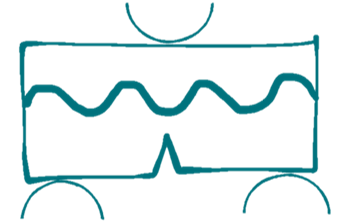
  <h1>Incremental Numerical Model to Explore Crack Propagation in Multilayer Polymers</h1>
  <p>
    <strong>Python scripting for automated crack initiation and propagation analysis using the Finite Element Method in Abaqus</strong><br>
    <i>Academic research project • Fracture mechanics</i>
  </p>

  <br>

  <p>
    
    
    
  </p>
</div>

<br>

## Research Objective

This repository contains Python scripts developed for **automated parametric studies of incremental crack propagation** in multilayer polymer  using **Abaqus (Finite Element Method)**.

Three python scripts has been provided for simulation:

- Multilayer polymer with a **wavy interlayer**
- Multilayer polymer with a **flat interlayer**
- **Pure (monolithic) polymer**


---

## Incremental Crack Propagation Methodology

The incremental crack propagation strategy implemented in this repository is an **energy-based, displacement-controlled numerical approach**. A schematic illustration of the algorithmic workflow is shown below, highlighting the outer displacement loop and the inner crack-growth loop.

The analysis starts by applying a prescribed displacement to the specimen. At each displacement level, the total strain energy of the system is extracted from the Abaqus output database using the `ALLSE` variable.

A candidate crack increment is introduced by releasing the next node along a predefined crack path while keeping the external displacement unchanged. The released strain energy is computed as the difference in total strain energy before and after node opening.

The energy release rate is evaluated as:

G = (Change in ALLSE) / (t × Δa)

where:
- t is the specimen thickness  
- Δa is the crack increment length  

If G is smaller than the critical fracture energy (Gc), the crack increment is rejected and the applied displacement is increased.  
If G is greater than or equal to Gc, the crack increment is accepted and the node remains permanently opened.

At the same displacement level, multiple crack increments may occur consecutively until the released energy drops below Gc.

<p align="center">
  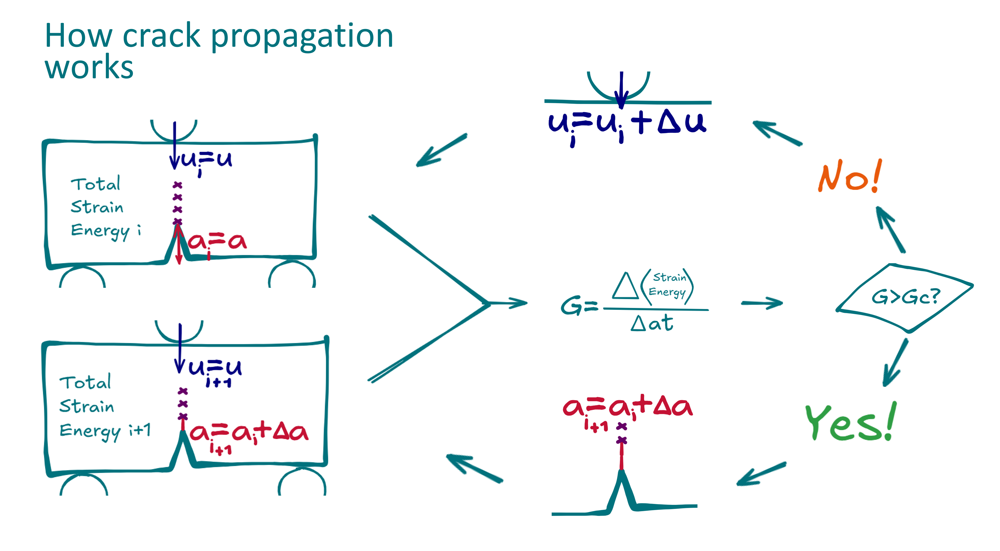
  <br><br>
  <em>Overview of the incremental crack propagation algorithm showing the displacement-increment loop and the energy-based crack advancement criterion.</em>
</p>

---

## Finite Element Model and Assumptions

<p align="center">
  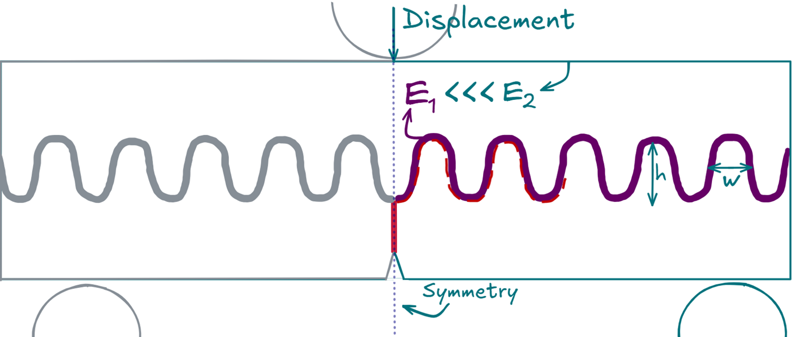
  <br><br>
  <em>Finite element model geometry, loading, and boundary conditions.</em>
</p>

<p align="center">
  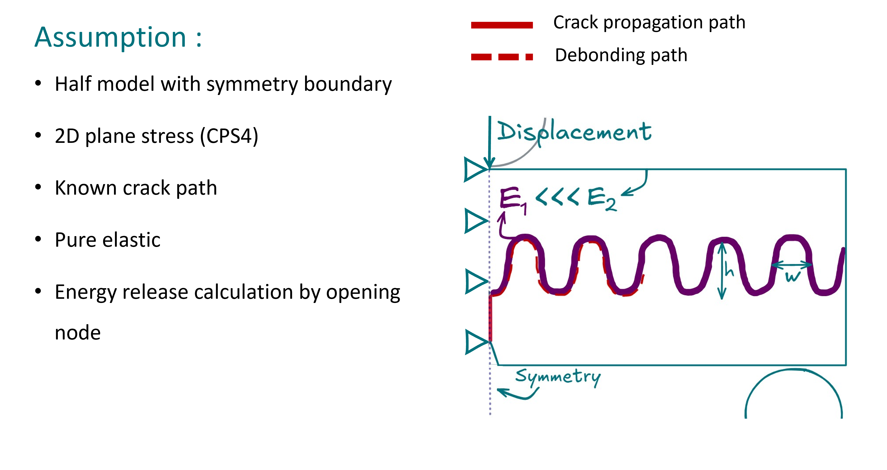
  <br><br>
  <em>Predefined crack path, nodal release strategy, and crack increment definition.</em>
</p>

The finite element model is developed based on the following assumptions:

- **Half-model with symmetry boundary condition**
- **Two-dimensional plane stress formulation (CPS4 elements)**
- **Predefined crack path**
- **Linear elastic material behavior**
- **Energy-based crack growth via nodal release**

Each crack increment corresponds to releasing one node (or node pair), resulting in a discrete crack advance length Δa.

---

## Mechanical Response and Energy Release Results

The follwing figure compares the force–displacement responses of:

1. **Pure (monolithic) polymer**
2. **Flat interlayer multilayer polymer**
3. **Wavy interlayer multilayer polymer**

The pure polymer model exhibits the highest initial stiffness and the largest peak force at the first load drop. However, this peak is followed by a sudden stiffness degradation, indicating unstable crack growth.

The flat interlayer configuration shows reduced stiffness and peak force compared to the pure model, but demonstrates a more progressive crack propagation response.

The wavy interlayer configuration provides improved mechanical performance compared to the flat interlayer. It exhibits higher stiffness and a larger peak force than the flat configuration. Moreover, stiffness degradation occurs more gradually, without a sharp drop, indicating enhanced crack resistance and improved structural stability.

These results clearly demonstrate that interlayer architecture significantly influences crack propagation behavior and overall structural performance.


<p align="center">
  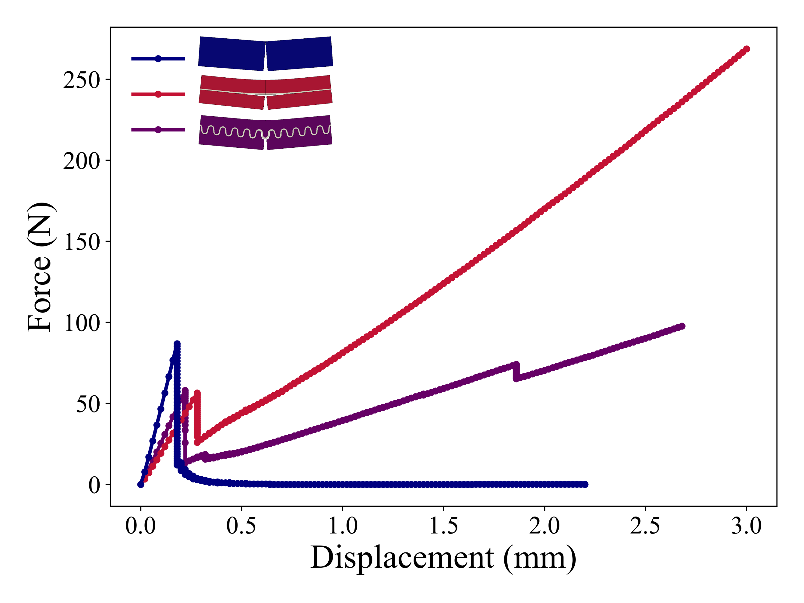
  <br><br>
  <em>Force–displacement Comparison
  </em>
</p>


<p align="center">
  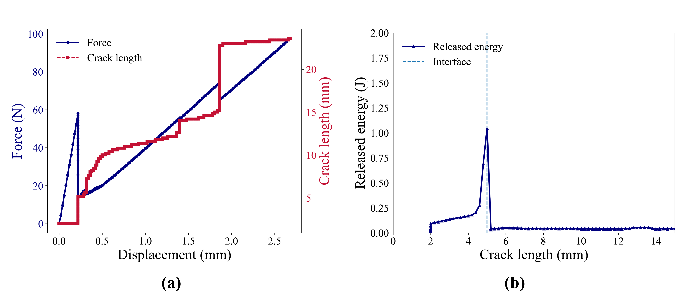
  <br><br>
  <em>
  wavy interlayer,
  (a) Force–displacement and crack length–displacement curves,  
  (b) Released strain energy versus crack length.
  </em>
</p>

<p align="center">
  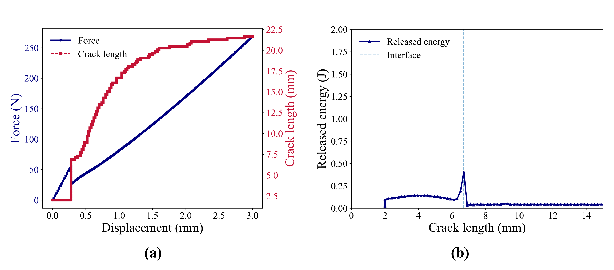
  <br><br>
  <em>flat interlayer,
  (a) Force–displacement and crack length–displacement curves,  
  (b) Released strain energy versus crack length.
  </em>
</p>

These curves describe the global mechanical response and quantify crack growth resistance as the crack approaches and interacts with the interlayer.

---

## Crack Propagation in Wavy Interlayer Configuration

<p align="center">
  
  <br>
  <em>Incremental crack propagation path in the multilayer polymer with a wavy interlayer.</em>
</p>

This animation focuses on the **geometrical evolution of the crack path** within the multilayer structure. Crack deflection and interaction with the wavy interlayer are  observed, highlighting the role of architectural design on crack trajectory.and the next animation is showing crack propagation in flat interlayer.

<p align="center">
  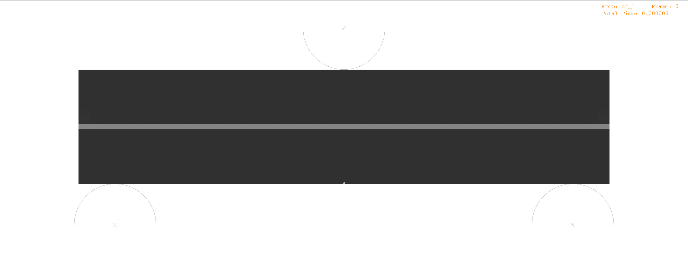
  <br>
  <em>Incremental crack propagation path in the multilayer polymer with a flat interlayer.</em>
</p>


---

## Synchronized Crack Tip Evolution and Boundary Condition Removal

This synchronized visualization provides a detailed, physics-based view of the crack propagation process. The figure simultaneously displays:

- Crack tip location and released nodes  
- Live values of applied force and displacement  
- Crack length evolution  
- Released strain energy  
- Maximum principal stress distribution  
- Force–displacement curve combined with crack length progression  

Crack propagation is controlled by the energy criterion. When the computed energy release rate satisfies **G ≥ Gc**, the boundary condition associated with the crack-tip node is removed.

In the visualization:
- **Orange rectangles represent active crack-tip boundary conditions**
- Upon crack advancement, the corresponding BCs are **deactivated and removed**
- Each BC removal corresponds to a successful crack increment

This approach ensures a physically consistent simulation of crack growth without introducing cohesive elements or artificial material degradation.

<p align="center">
  
  <br><br>
  <em>Crack tip location synchronized with mechanical response, energy release, stress field, and boundary condition evolution in wavy interlayer.</em>
</p>


<p align="center">
  
  <br><br>
  <em>Crack tip location synchronized with mechanical response, energy release, stress field, and boundary condition evolution in flat interlayer.</em>
</p>


---

# Future Study Suggestions

The present work establishes a robust energy-based incremental crack propagation framework. Several future extensions are suggested:

## 1. Mode Mixity Evaluation
Implement post-processing to extract K1 and K2 from displacement fields and evaluate G1/G2 evolution along the interface.

### Theoretical Background: Interface Fracture Mechanics

#### Dundurs' Parameters and Elastic Mismatch

The elastic mismatch between two bonded elastic materials is commonly expressed using **Dundurs’ parameters**.

The Dundurs parameter β is defined as:

            [ μ1 (k2 − 1) − μ2 (k1 − 1) ]  
    β = -------------------------------------  
            [ μ1 (k2 + 1) + μ2 (k1 + 1) ]

where:

- μ1, μ2 are shear moduli of materials 1 and 2  
- k = (3 − ν)/(1 + ν) for plane stress  


The oscillatory index ε governing interface crack fields is:

ε = (1 / 2π) ln [ (1 − β) / (1 + β) ]

<p align="center">
  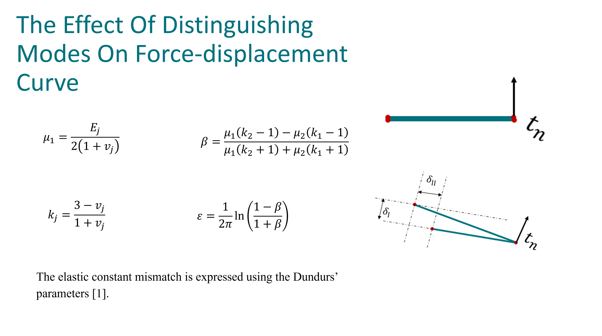
  <br><br>
  <em>Derivation of Mode Mixity step 1.</em>
</p>

#### Oscillatory Singularity at Bimaterial Interfaces

Unlike cracks in homogeneous materials, interface cracks exhibit an **oscillatory singularity**.

The near-tip stress field at θ = 0 can be written as:

(σ11 + iσ12) = K / sqrt(2πr) × r^(iε)

The relative displacement jump across the interface is:

Δu(r) = δI(r) + i δII(r)

and can be expressed as:

Δu(r) = A K sqrt(r / 2π) × r^(iε)

where:

- r is the radial distance from crack tip  
- K is the complex stress intensity factor  
- A is a material-dependent constant  
- ε is the oscillatory index  

<p align="center">
  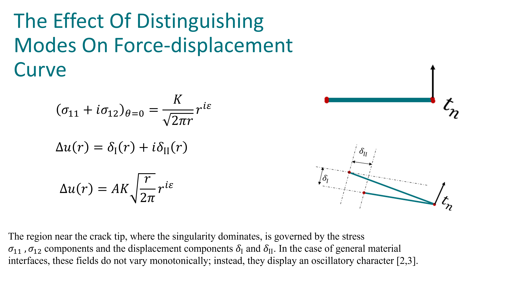
  <br><br>
  <em>Derivation of Mode Mixity step 2.</em>
</p>

#### Complex Stress Intensity Factor

The complex stress intensity factor is defined as:

K = K1 + iK2

where:

- K1 = mode-I contribution  
- K2 = mode-II contribution  

Using Euler’s identity:

r^(iε) = cos(ε ln r) + i sin(ε ln r)

Substituting into displacement expressions:

δI(r)  = A sqrt(r / 2π) [ K1 cos(ε ln r) − K2 sin(ε ln r) ]  
δII(r) = A sqrt(r / 2π) [ K2 cos(ε ln r) + K1 sin(ε ln r) ]


#### Derivation of Mode Mixity and G1/G2 Ratio

For bimaterial interface cracks, the mode mixity can be related to displacement components.

Using the displacement expressions and Dundurs parameter β, the mode ratio can be expressed as:

(G1 / G2)  = [ (δI − β δII) / (δII + β δI) ]^2

This relation links:

- Energy release components (G1, G2)  
- Interface displacement jumps  
- Elastic mismatch (β)  

This theoretical framework provides a basis for future extension of the present numerical model toward full interface fracture characterization in multilayer systems.

<p align="center">
  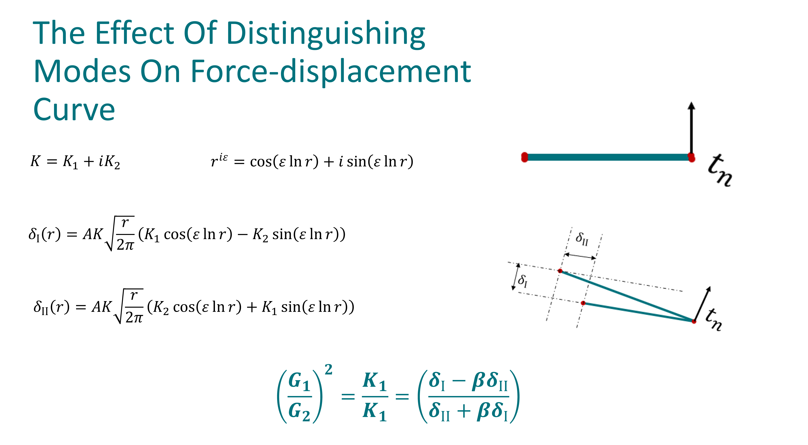
  <br><br>
  <em>Derivation of Mode Mixity and G1/G2 Ratio.</em>
</p>


---
## 2. Crack-Tip-Dependent Friction Evolution

Investigate the effect of updating the friction coefficient along the crack interface as a function of crack-tip location. In this approach, the friction behavior (friction function) is dynamically modified based on the current crack position and local contact state.

Such an extension would allow:

- Modeling transition from bonded to sliding contact conditions  
- Studying the influence of frictional resistance on crack propagation stability  
- Evaluating energy dissipation due to interfacial friction after crack opening  

Incorporating crack-tip-dependent friction evolution would provide a more realistic representation of post-failure contact mechanics and its influence on global structural response.

---

## 3. Cohesive Zone Model (CZM) Comparison

Compare the current nodal-release strategy with cohesive zone modeling (CZM) to evaluate numerical stability, convergence behavior, and physical consistency.

Using a cohesive traction–separation law enables simulation of progressive damage instead of discrete node release. The comparison should include investigation of:

- Mixed-mode fracture behavior (Mode I and Mode II interaction)  
- Influence of mode mixity on crack initiation and propagation path  
- Sensitivity of results to cohesive parameters (maximum traction, fracture energy, softening law)  


Such a comparison would clarify the advantages and limitations of the energy-based nodal release method relative to cohesive zone approaches.

## 4. Elastoplastic Matrix Modeling
Extend the current linear elastic formulation by incorporating elastoplastic constitutive models for the polymer matrix material. Appropriate hardening laws (e.g., isotropic or combined hardening) should be implemented to capture:

- Yield stress
- Post-yield plastic deformation
- Strain hardening behavior

In this extended framework, crack propagation should no longer be governed solely by elastic strain energy (ALLSE). Instead, the fracture driving force must account for both elastic and plastic energy contributions.

The total energy release rate can therefore be expressed as:

G_total = (ΔALLSE + ΔALLPD) / (t · Δa)

where:

- ALLSE = elastic strain energy  
- ALLPD = plastic dissipation energy  
- t = specimen thickness  
- Δa = crack increment length  

Including plastic dissipation enables investigation of crack-tip plastic zone development and its contribution to apparent fracture toughness. This extension is particularly important for ductile polymer matrices, where significant energy absorption occurs through plastic deformation prior to crack advancement.

## 5. Crack Velocity and Its Role in Energy Release Requirements for Crack Opening 


## 6. 3D Crack Front Extension
Extend the methodology to three-dimensional multilayer structures and analyze crack front curvature.

## 7. Experimental Validation
Validate numerical predictions with fracture experiments on architectured multilayer polymers.

---

# References

[1] Dundurs, J. (1969). Discussion: Edge-bonded dissimilar orthogonal elastic wedges under normal and shear loading. Journal of Applied Mechanics, ASME.

[2] Williams, M.L. (1959). The stresses around a fault or crack in dissimilar media. Bulletin of the Seismological Society of America, 49, 199–204.

[3] Salganik, R.L. (1963). The brittle fracture of cemented bodies. Journal of Applied Mathematics and Mechanics, 27, 1468–1478.

[4] Suo, Z., Hutchinson, J.W. (1990). Interface crack between two elastic layers. International Journal of Fracture.

## Project Structure

```text
Incremental_Crack_Propagation/
├── src/
│   ├── 01_Main_code_wavy.py            			      # Incremental crack propagation: wavy interlayer
│   ├── 02_Main_code_flat.py            			      # Incremental crack propagation: flat interlayer
│   ├── 03_Main_code_pure.py            			      # Incremental crack propagation: pure material
│   ├── 1_Post_processing_merge_ODBs.py 			      # Post-processing 1
│   ├── 2_Post_processing_crop_video.py 			      # Post-processing 2
│   ├── 3_Post_processing_final_video.py 			      # Post-processing 3
│   ├── 4_Post_processing_force_displacement.py 	  # Post-processing 4
├── results/                                        # Simulation results
├── docs/                                           # Documentation and figures
└── README.md
